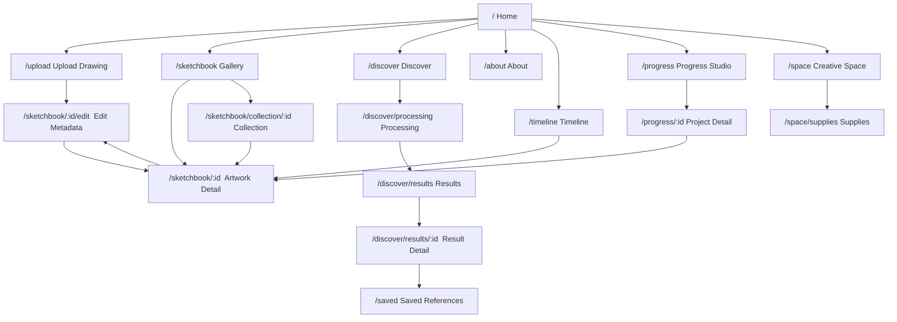

# Screen Flow Map

## Navigation Architecture



---

## Screen Inventory

### Primary Navigation Screens (Always Accessible)

| Route | Screen | Phase | Description |
|---|---|---|---|
| `/` | HomeScreen | 1 (modify) | Dashboard with recent work / Hero if empty |
| `/sketchbook` | SketchbookScreen | 2 (new) | Personal artwork gallery with filters |
| `/discover` | DiscoverScreen | 5 (refactor) | Upload for similarity search |
| `/about` | AboutScreen | 0 (exists) | Studio manifesto |

### Secondary Navigation Screens

| Route | Screen | Phase | Description |
|---|---|---|---|
| `/timeline` | TimelineScreen | 4 (new) | Calendar/chronological view |
| `/progress` | ProgressStudioScreen | 4 (new) | Projects overview |
| `/saved` | SavedReferencesScreen | 5 (new) | Saved discovery references |
| `/space` | CreativeSpaceScreen | 6 (new) | Personal art room |

### Detail and Action Screens

| Route | Screen | Phase | Description |
|---|---|---|---|
| `/upload` | UploadScreen | 2 (modify) | Drawing upload flow |
| `/sketchbook/:id` | ArtworkDetailScreen | 2 (new variant) | Personal artwork detail |
| `/sketchbook/:id/edit` | ArtworkEditScreen | 2 (new) | Metadata editing form |
| `/sketchbook/collection/:id` | CollectionDetailScreen | 2 (new) | Collection view |
| `/discover/processing` | ProcessingScreen | 5 (modify) | Search processing |
| `/discover/results` | ResultsScreen | 5 (modify) | Search results |
| `/discover/results/:id` | ResultDetailScreen | 5 (modify) | Individual result detail |
| `/progress/:id` | ProjectDetailScreen | 4 (new) | Project with versions |
| `/space/supplies` | SuppliesScreen | 6 (new) | Materials list |

---

## User Flow Diagrams

### Flow 1: First-Time User

```
Open app → Home (hero landing, no artworks)
  → Click "Upload a Drawing"
  → Upload screen → Select file → Compress → Store
  → Edit metadata screen → Enter title, date, medium, tags → Save
  → Artwork detail screen (see the preserved drawing)
  → Navigate to Sketchbook → See first artwork in gallery
```

### Flow 2: Returning User — Quick Upload

```
Open app → Home (dashboard with recent artworks)
  → Click "Upload" in navigation
  → Upload screen → Select file → Compress → Store
  → Edit metadata → Save
  → Artwork detail
```

### Flow 3: Browsing and Organizing

```
Open app → Sketchbook gallery
  → Filter by medium (e.g., "Ink pen")
  → Click artwork card → Detail view
  → Click "Edit" → Update tags, add to collection → Save
  → Back to gallery (filtered view persists)
```

### Flow 4: Discovery Journey

```
Open app → Click "Discover"
  → Upload/select drawing → Submit for search
  → Processing screen (animated, 2-3 seconds)
  → Results grid → Browse similar artworks
  → Click result → Detail with similarity explanation
  → Click "Save to References" → Saved
  → Navigate to Saved References → See all saved discoveries
```

### Flow 5: Timeline Browsing

```
Open app → Navigate to Timeline
  → See calendar grid with thumbnail dots on active days
  → Click a day → See artworks created that day
  → Click artwork → Detail view
```

### Flow 6: Progress Tracking

```
Open app → Navigate to Progress Studio
  → Click "New Project" → Enter title, goal
  → Upload first version → Edit metadata → Save
  → Later: Upload new version to same project
  → View project → See all versions in a timeline
  → Click "Compare" → Side-by-side or overlay comparison
```

---

## Screen State Matrix

Each screen can be in one of these states:

| State | Visual Treatment |
|---|---|
| Loading | ART-11 spiral spinner or concentric disc pulse |
| Empty | ART-01 crane with contextual message |
| Error | ART-09 mushroom creature with error message + retry |
| Content | Normal content rendering |

### Per-Screen State Table

| Screen | Loading | Empty | Error | Content |
|---|---|---|---|---|
| Home | Spinner | Hero landing (existing) | ART-09 | Dashboard with recent work |
| Sketchbook | Grid skeleton | ART-01 + "Your sketchbook is empty" | ART-09 | Artwork grid |
| Artwork Detail | Image loading | N/A (404 if not found) | ART-09 | Full detail |
| Artwork Edit | Form loading | N/A | ART-09 | Edit form |
| Upload | N/A | Dropzone (existing) | ART-09 + "Upload failed" | File selected preview |
| Processing | Concentric portal (existing) | N/A | ART-09 + "Search failed" | Animation |
| Results | Grid skeleton | ART-01 + "No similar art found" | ART-09 | Result cards |
| Result Detail | Image loading | N/A | ART-09 | Full detail |
| Favorites/Saved | Grid skeleton | ART-01 + "Nothing saved yet" (existing) | ART-09 | Saved cards |
| Timeline | Calendar loading | ART-01 + "No artwork dated yet" | ART-09 | Calendar grid |
| Progress | List loading | ART-01 + "No projects yet" | ART-09 | Project list |
| Project Detail | List loading | ART-01 + "Add first version" | ART-09 | Version timeline |
| Creative Space | Section loading | ART-01 + "Set up your space" | ART-09 | Configured space |
| Supplies | List loading | ART-01 + "Add your first supply" | ART-09 | Supply list |
| About | N/A (static) | N/A | N/A | Editorial content (existing) |

---

## Shared UI Patterns Across Screens

### Pattern: Artwork Grid

Used in: Sketchbook, Collection Detail, Favorites, Saved References, Results, Timeline day view, Project versions

### Pattern: Detail View (Two-Column)

Used in: Artwork Detail (personal), Result Detail (discovery), Project Detail

### Pattern: Edit Form

Used in: Artwork Edit, Collection Edit, Project Edit, Material Edit

### Pattern: Empty State

Used in: Every screen with dynamic content

### Pattern: Page Header

Used in: Every screen (icon + eyebrow + title + description)
